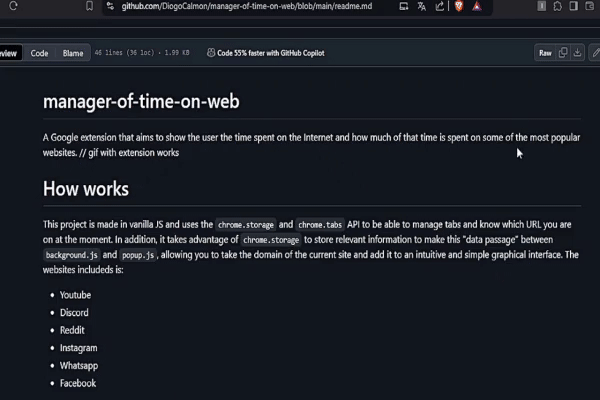

# manager-of-time-on-web
A Google extension that aims to show the user the time spent on the Internet and how much of that time is spent on some of the most popular websites.


# How works
This project is made in vanilla JS and uses the ```chrome.storage``` and ``chrome.tabs`` API to be able to manage tabs and know which URL you are on at the moment. In addition, it takes advantage of ``chrome.storage`` to store relevant information to make this "data passage" between ``background.js`` and ``popup.js``, allowing you to take the domain of the current site and add it to an intuitive and simple graphical interface.
The websites includeds is:
- Youtube
- Discord
- Reddit
- Instagram
- Whatsapp
- Facebook
 
any other site will be treated as "others"

The timer logic is done in JavaScript where I create 3 object properties: hours, minutes and seconds, they are responsible for calculating the time of the timers and every time I enter a new tab I save these values ​​in an array of objects to send the data to the ```popup.js``` file, where I apply the second logic.
In the second logic I make a loop that goes through all the elements of the array (the objects) that I had created in the previous logic and for each element of this array I create a div in the HTML of my extension using DOM

# How restart the timer
Just restart the extension :) ( but probably i will made a update for fix this )

# How to contribute
Fell free :)
just don't forget to give due credits

# License

MIT License

Copyright (c) 2024 Diogo Calmon

Permission is hereby granted, free of charge, to any person obtaining a copy
of this software and associated documentation files (the "Software"), to deal
in the Software without restriction, including without limitation the rights
to use, copy, modify, merge, publish, distribute, sublicense, and/or sell
copies of the Software, and to permit persons to whom the Software is
furnished to do so, subject to the following conditions:

The above copyright notice and this permission notice shall be included in all
copies or substantial portions of the Software.

THE SOFTWARE IS PROVIDED "AS IS", WITHOUT WARRANTY OF ANY KIND, EXPRESS OR
IMPLIED, INCLUDING BUT NOT LIMITED TO THE WARRANTIES OF MERCHANTABILITY,
FITNESS FOR A PARTICULAR PURPOSE AND NONINFRINGEMENT. IN NO EVENT SHALL THE
AUTHORS OR COPYRIGHT HOLDERS BE LIABLE FOR ANY CLAIM, DAMAGES OR OTHER
LIABILITY, WHETHER IN AN ACTION OF CONTRACT, TORT OR OTHERWISE, ARISING FROM,
OUT OF OR IN CONNECTION WITH THE SOFTWARE OR THE USE OR OTHER DEALINGS IN THE
SOFTWARE.